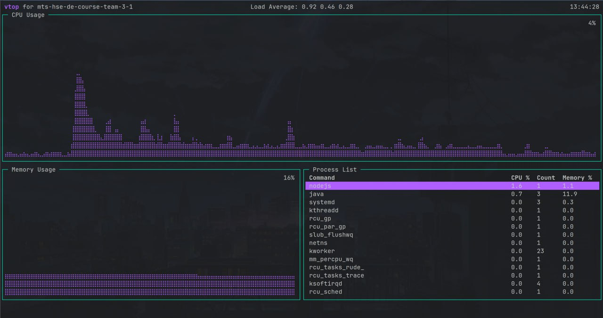
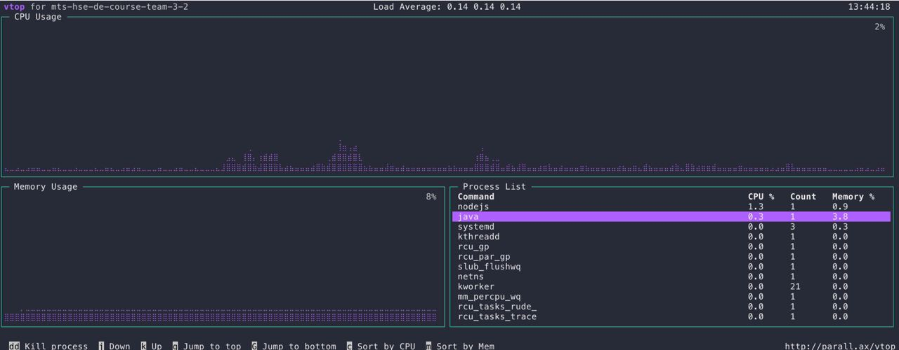
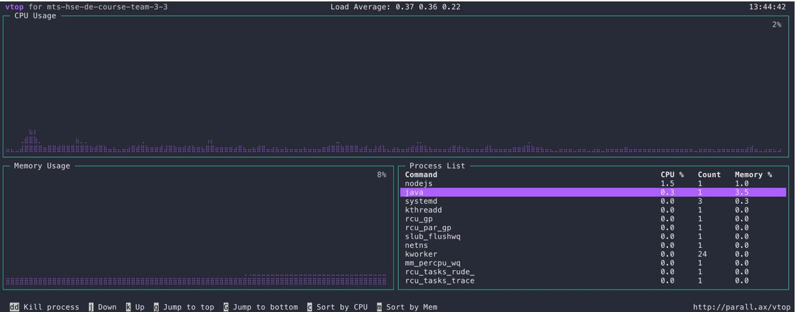
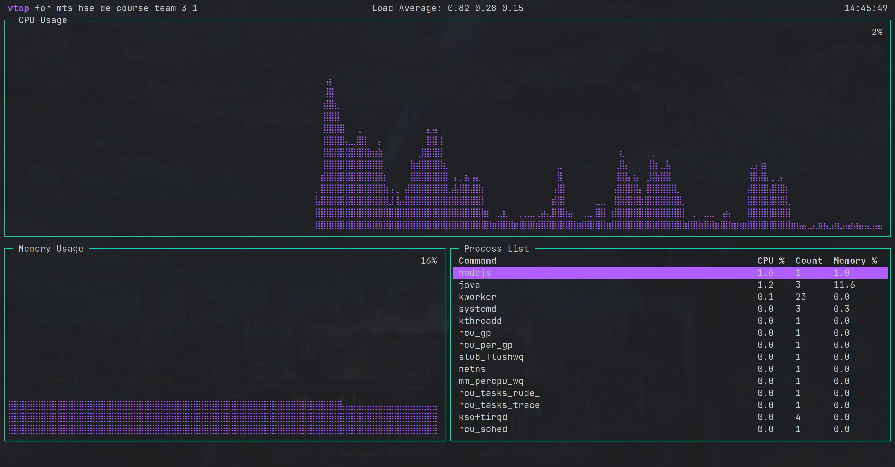
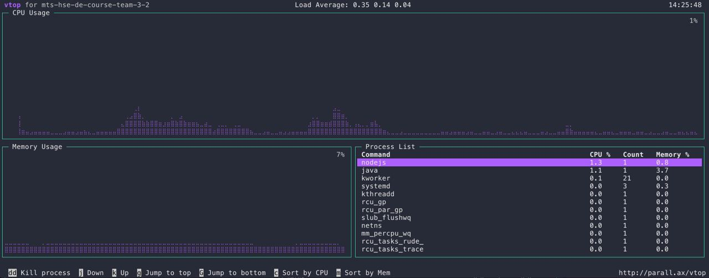
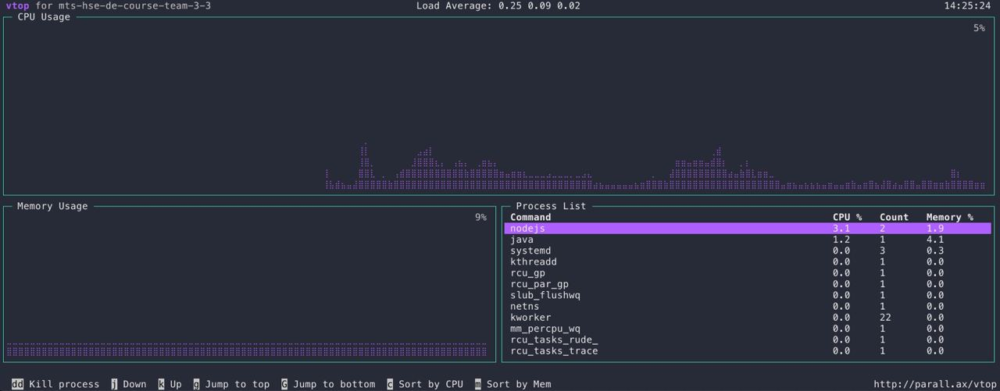

## Загрузка большого файла

Большой файл сгенерирован с помощью:
```bash
dd if=/dev/urandom of=./kek count=3000000
```

Размер файла - 1.5GB

Загружаем файл на hdfs:
```bash
hdfs dfs -put /tmp/kek /bigfile
```

Занятая память на трех нодах:
```bash
df -h -BM /

main
Filesystem     1M-blocks   Used Available Use% Mounted on
/dev/sda2        301537M 10746M   278367M   4% /

worker1
Filesystem     1M-blocks  Used Available Use% Mounted on
/dev/sda2        301537M 9061M   280052M   4% /

worker2
Filesystem     1M-blocks  Used Available Use% Mounted on
/dev/sda2        301537M 9050M   280063M   4% /
```

Журнал изменений и образ ФС:
```bash
du -ah .
4.0K    ./fsimage_0000000000000000000
4.0K    ./edits_0000000000000000001-0000000000000000002
4.0K    ./fsimage_0000000000000000000.md5
4.0K    ./VERSION
1.0M    ./edits_inprogress_0000000000000000003
4.0K    ./seen_txid
1.1M    .


```

После запуска:
```bash
main
Filesystem     1M-blocks   Used Available Use% Mounted on
/dev/sda2        301537M 12223M   276890M   5% /

worker1
Filesystem     1M-blocks   Used Available Use% Mounted on
/dev/sda2        301537M 10538M   278575M   4% /

worker2
Filesystem     1M-blocks   Used Available Use% Mounted on
/dev/sda2        301537M 10538M   278575M   4% /
```

Директория с журналом изменений и образом ФС:
```bash
4.0K    ./fsimage_0000000000000000000
4.0K    ./edits_0000000000000000001-0000000000000000002
4.0K    ./edits_0000000000000000003-0000000000000000004
4.0K    ./edits_0000000000000000005-0000000000000000006
4.0K    ./edits_0000000000000000009-0000000000000000049
4.0K    ./edits_0000000000000000007-0000000000000000008
1.0M    ./edits_inprogress_0000000000000000050
4.0K    ./fsimage_0000000000000000000.md5
4.0K    ./VERSION
4.0K    ./seen_txid
1.1M    .
```

Профиль CPU и памяти во время исполнения:

main


worker1


worker2


+1.5GB на всех нодах

## Загрузка маленьких файлов

Генерация:
```bash
for i in $(seq 1 1000); do dd if=/dev/urandom of=./kek$i count=3000; done
```

Занятая память на трех нодах:
```bash
df -h -BM /

main
Filesystem     1M-blocks  Used Available Use% Mounted on
/dev/sda2        301537M 9062M   280052M   4% /

worker1
Filesystem     1M-blocks  Used Available Use% Mounted on
/dev/sda2        301537M 9061M   280052M   4% /

worker2
Filesystem     1M-blocks  Used Available Use% Mounted on
/dev/sda2        301537M 9062M   280052M   4% /
```

Журнал изменений и образ ФС:
```bash
du -ah .
4.0K    ./fsimage_0000000000000000000
4.0K    ./edits_0000000000000000001-0000000000000000002
4.0K    ./edits_0000000000000000003-0000000000000000004
1.0M    ./edits_inprogress_0000000000000000007
4.0K    ./edits_0000000000000000005-0000000000000000006
4.0K    ./fsimage_0000000000000000000.md5
4.0K    ./VERSION
4.0K    ./seen_txid
1.1M    .
```

```bash
hdfs dfs -put /tmp/keks /data
```

После запуска:
```bash
main
Filesystem     1M-blocks   Used Available Use% Mounted on
/dev/sda2        301537M 10539M   278574M   4% /

worker1
Filesystem     1M-blocks   Used Available Use% Mounted on
/dev/sda2        301537M 10539M   278574M   4% /

worker2
Filesystem     1M-blocks   Used Available Use% Mounted on
/dev/sda2        301537M 10539M   278574M   4% /
```

Директория с журналом изменений и образом ФС:
```bash
4.0K    ./fsimage_0000000000000000000
4.0K    ./edits_0000000000000000001-0000000000000000002
292K    ./edits_0000000000000000011-0000000000000003619
1.0M    ./edits_inprogress_0000000000000006016
4.0K    ./edits_0000000000000000003-0000000000000000004
196K    ./edits_0000000000000003620-0000000000000006015
4.0K    ./edits_0000000000000000005-0000000000000000006
4.0K    ./edits_0000000000000000007-0000000000000000008
4.0K    ./fsimage_0000000000000000000.md5
4.0K    ./VERSION
4.0K    ./edits_0000000000000000009-0000000000000000010
4.0K    ./seen_txid
1.6M    .
```

Можно видеть, что теперь edits_* занимают сильно больше места

Профиль CPU и памяти во время исполнения:

main


worker1


worker2

