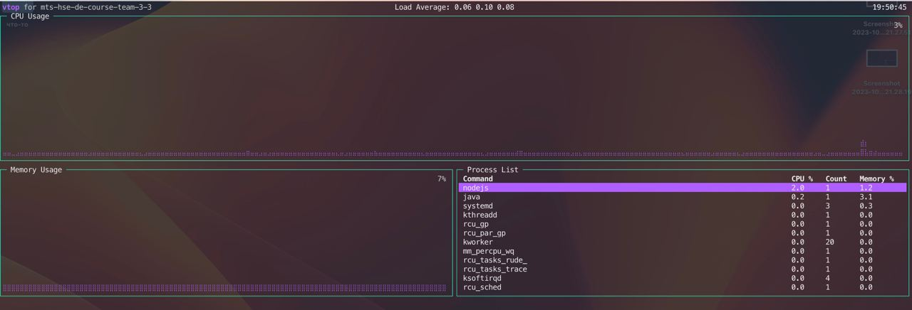

## MapReduce

Мы взяли [датасет](https://www.kaggle.com/datasets/dhruvildave/spotify-charts) с топом чартов spotify за последние несколько лет (в сжатом виде 1gb, в несжатом 3.3gb).
В качестве задачи для map reduce выбрали "посчитать суммарное количество попаданий в чарт по странам"

Код map и reduce находится в `mr/bin`

### Запуск без hadoop

Копируем бинари:
```bash
cd mr/bin/map/
go build
cd ../reduce/
go build
cd ..
scp ./map/map team3@91.185.86.24:/tmp/
scp ./reduce/reduce team3@91.185.86.24:/tmp/
```

Качаем [файл](https://www.kaggle.com/datasets/dhruvildave/spotify-charts)
```bash
scp archive.zip team3@91.185.86.24:/tmp/
```
 
```bash
sudo apt install unzip
unzip archive.zip 
```

Запуск:
```bash
cd /tmp
/usr/bin/time bash -c 'cat charts.csv | ./map | sort | ./reduce > without_hadoop.txt'
 
41.44user 39.64system 0:58.15elapsed 139%CPU (0avgtext+0avgdata 9412maxresident)k
0inputs+1228320outputs (0major+32370minor)pagefaults 0swaps
``` 

### Настройка yarn
 
```bash
sudo vim /usr/local/hadoop/etc/hadoop/mapred-site.xml
 
...
<!-- Put site-specific property overrides in this file. -->
 
<configuration>
   <property>
      <name>mapreduce.framework.name</name>
      <value>yarn</value>
   </property>
</configuration>
```
 
```bash
sudo vim /usr/local/hadoop/etc/hadoop/yarn-site.xml
 
...
<configuration>
 
<!-- Site specific YARN configuration properties -->
  <property>
    <name>yarn.nodemanager.aux-services</name>
    <value>mapreduce_shuffle</value>
  </property>
</configuration>
```
 
```bash
   <property>
     <name>yarn.app.mapreduce.am.env</name>
     <value>HADOOP_MAPRED_HOME=/usr/local/hadoop</value>
   </property>
   <property>
     <name>mapreduce.map.env</name>
     <value>HADOOP_MAPRED_HOME=/usr/local/hadoop</value>
   </property>
   <property>
     <name>mapreduce.reduce.env</name>
     <value>HADOOP_MAPRED_HOME=/usr/local/hadoop</value>
   </property>
   <property>
      <name>mapreduce.framework.name</name>
      <value>yarn</value>
   </property>
```

### Запуска на трех нодах:

```bash
/usr/local/hadoop/sbin/start-all.sh
hdfs dfs -put /tmp/charts.csv /charts.csv
```
 
```bash
hadoop jar $HADOOP_HOME/share/hadoop/tools/lib/hadoop-streaming-*.jar -files /tmp/map,/tmp/reduce -input /charts.csv -output output -mapper /tmp/map -reducer /tmp/reduce
```

В интерфейсе yarn можно увидеть ресурсы:
```
Elapsed: 	2mins, 10sec
Aggregate Resource Allocation: 	910037 MB-seconds, 739 vcore-seconds
```

Результат можно посмотреть с помощью:

```bash
hdfs dfs -head /user/hadoop/output/part-00000
```

main(начало)


main(конец)


worker1


worker2


### Запуск на одной ноде:

```
Elapsed: 	2mins, 10sec
Aggregate Resource Allocation: 	940060 MB-seconds, 759 vcore-seconds 
```

main

